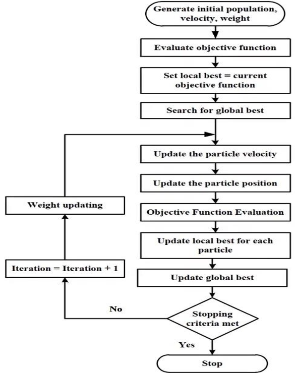
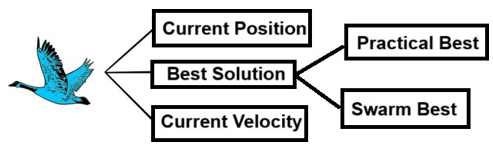

# Particle Swarm Optimization (PSO) Algorithm Notes

## Overview
PSO is a stochastic population-based algorithm designed for nonlinear continuous optimization problems. It is inspired by the social behavior and dynamic movements of birds and fish, which seeks to optimize its position and velocity iteratively.

## Flowchart

  

## Key Concepts
### Combining Self-Experiences with Social Experiences
PSO enables particles to adapt their movements based on:
- Particle's personal best solution "Pbest"
- Swarm's global best solution "Gbest"

## Four Factors

  

### Factors Considered by Each Particle
1. Current position
2. Current velocity
3. Personal best position
4. Global best position

## How PSO Works
1. Initialize a population of particles uniformly distributed.
2. Evaluate each particle's position according to the objective function.
3. Update the particle's best-known position.
4. Determine the best particle.
5. Update particles' velocities using the formula:
    `V(t + 1) = wV(t) + c1r1(Pbest - P(t)) + c2r2(Gbest - P(t))`
      - `w` is the inertia weight.
      - `c1` is the learning rate for personal best.
      - `c2` is the learning rate for global best.
      - `r1` and `r2` are random numbers in [0, 1].
6. Move particles to their new positions:
    ` P(t + 1) = P(t) + V(t + 1)`
7. Repeat until stopping criteria are met.

## Inertia in PSO
The inertia term balances exploration and exploitation, enabling particles to maintain their movement in the same direction with the same velocity.

## Diversification and Intensification
- **Intensification**: Finds the best solution within a region based on previous solutions.
- **Diversification**: Searches for new solutions and identifies regions with potentially better solutions.

## Advantages and Disadvantages
### Advantages:
1. Insensitivity to variable scaling
2. Simple implementation
3. Easily parallelized
4. Few algorithm parameters
5. Effective global search

### Disadvantages:
1. Prone to premature convergence
2. Weak local search capability

