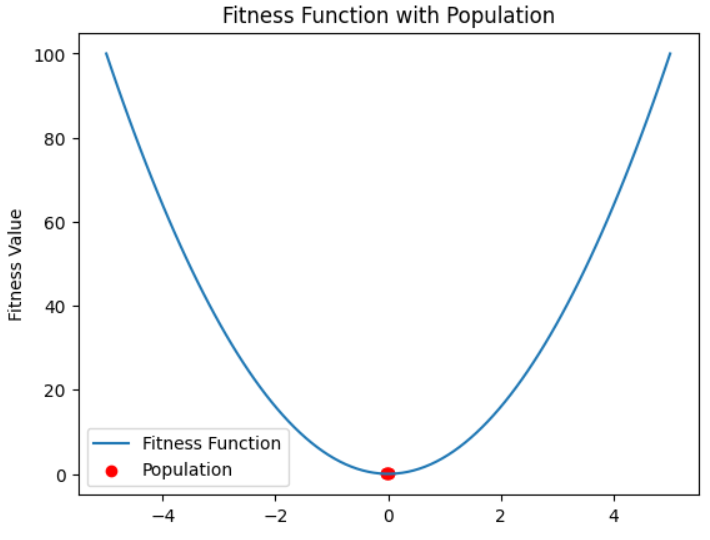

# Particle Swarm Optimization (PSO) Algorithm


## Description
This repository contains a Python implementation of the Particle Swarm Optimization (PSO) algorithm. PSO is a computational method used for optimizing a wide range of functions by simulating the social behavior of birds within a flock. It is widely used in artificial intelligence, machine learning, and other computational fields for solving optimization problems.

## Installation
1. Clone the repository: `git clone https://github.com/KhalidMustafaElenani/Particle-Swarm-Optimization-Algorithm.git`
2. Navigate to the project directory: `cd Particle-Swarm-Optimization-Algorithm`

## Usage Examples
  - Run the PSO algorithm by executing the main.py file: `python PSO_Algorithm.ipynb`

## Example Output
```
Iteration 50:
---------------
Particle 1: [Position: [-0.04  0.06  0.01  0.09]  Velocity: [-0.01 -0.02 -0.03  0.16]  Fitness: 0.01    Personal Best: [-0.01  0.06  0.03  0.09]]
Particle 2: [Position: [-0.02  0.07 -0.03  0.07]  Velocity: [ 0.01  0.   -0.01 -0.  ]  Fitness: 0.01    Personal Best: [-0.02  0.07 -0.03  0.07]]
Particle 3: [Position: [ 0.01  0.06 -0.11  0.08]  Velocity: [ 0.04 -0.05 -0.34  0.  ]  Fitness: 0.02    Personal Best: [-0.06  0.03  0.07  0.08]]
Particle 4: [Position: [-0.04  0.07  0.01  0.07]  Velocity: [-0.01 -0.    0.   -0.01]  Fitness: 0.01    Personal Best: [-0.04  0.07  0.01  0.07]]
Particle 5: [Position: [0.01 0.06 0.01 0.07]      Velocity: [ 0.04 -0.01  0.07 -0.01]  Fitness: 0.01    Personal Best: [0.01 0.06 0.01 0.07]]

Global Best Value: [0.01 0.06 0.01 0.07]          Score: 0.01
```
<p align="center">
  
</p>

For detailed setup instructions and execution, refer to the [NOTES.md](NOTES.md).
